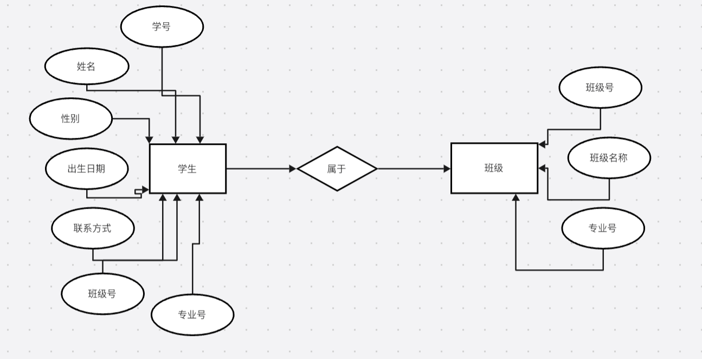
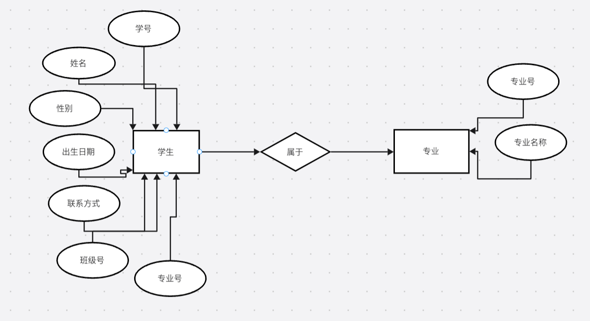
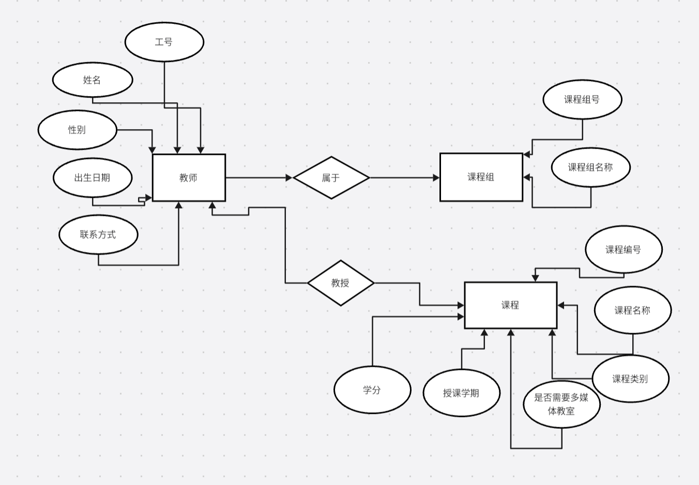
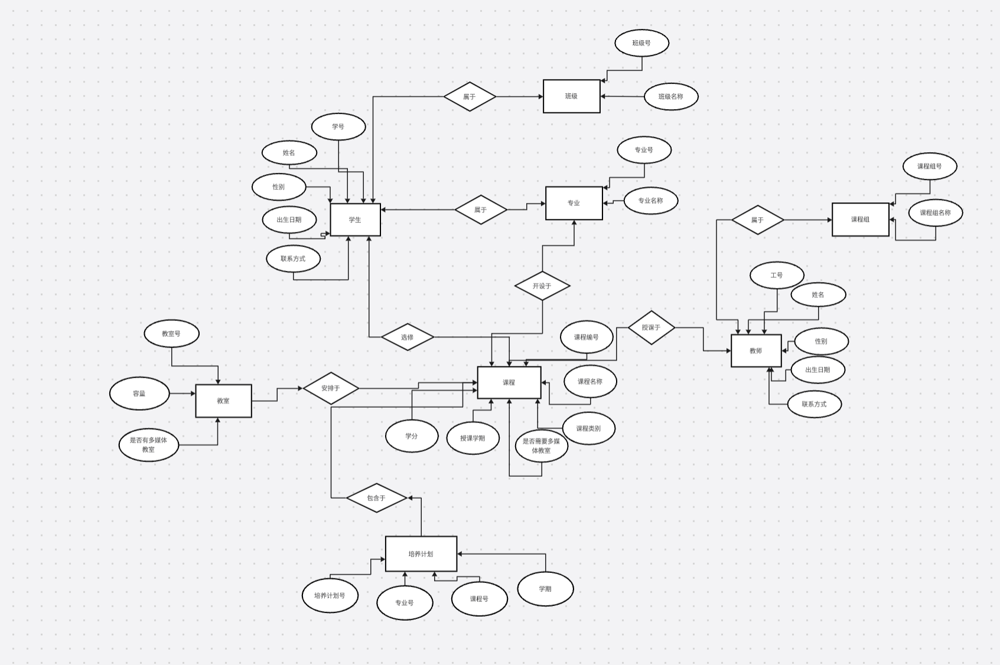

<h1>高校教务管理系统</h1>	
需求描述：某高校有若干系，每系又分为若干专业，每个专业有若干学生和教师。学生被分在若干班级中，一个学生只能属于一个班级，一个班级的学生都是一个专业的；教师则被分在不同的课程组，一个教师可以属于多个课程组，某个课程组的老师才有资格讲授该门课程。学生须在大学四年中修满规定的学分，其中有一部分为必修课，另一部分是选修课；必修课以班级为最小单位安排上课教室及上课老师，多个班级可以安排在一个教室上课。每个专业都有自己的培养计划，规定该专业的学生应在大学四个学年或八学期中修完哪些必修课，并在指定的选修课修满选修学分。该计划同时指定了这些必修课或选修课所设的学期。所有教学活动均在教室进行，但上机与实验则在机房或实验室进行。不同的教室、实验室或机房可容纳不同的人数。有的教室有多媒体设施，有的没有。有的课程必须在多媒体教室完成教学，有的则不然。 
功能描述： 
 学生、教师、课程、专业、教室等基本信息管理；  
 培养计划的制订功能；排课功能；  
 选修课的选修功能（先有课表，然后方许学生选修）；  
 成绩登记功能（只有任课教师才有权登记该门课程的成绩，但只能在该课程结束后一个月内登记，登记完毕后，任课老师要给予确认，此后再不能修改。在一个月快要结束的前一个星期，教务管理员应收到提醒，得知哪些老师尚未完成成绩的登记，以便电话通知这些任课老师）；  
 成绩的统计、查询与打印功能（单人、单科、班级等成绩的打印）；学分的查询与统计； 

<h2>需求分析</h2>	
<h3>实体</h3>	
<h4>1.学生（Student）</h4>
o学号（StudentID）：唯一标识学生的编号  
o姓名（Name）：学生姓名  
o性别（Gender）：学生性别  
o出生日期（DOB）：学生出生日期  
o所属专业（MajorID）：学生所属专业编号  
o所属班级（ClassID）：学生所属班级编号  
o学籍状态（Status）：在校、休学、退学等  
<h4>2.教师（Teacher）</h4>
o工号（TeacherID）：唯一标识教师的编号  
o姓名（Name）：教师姓名  
o性别（Gender）：教师性别  
o所属课程组（CourseGroupID）：教师所属课程组编号  
o联系方式（Contact）：教师联系方式  
<h4>3.课程（Course）  </h4>
o课程编号（CourseID）：唯一标识课程的编号  
o课程名称（CourseName）：课程名称  
o学分（Credits）：课程学分  
o课程性质（CourseType）：必修或选修  
o所属课程组（CourseGroupID）：课程所属课程组编号  
o多媒体需求（Multimedia）：是否需要多媒体教室  
<h4>4.专业（Major）  </h4>
o专业编号（MajorID）：唯一标识专业的编号  
o专业名称（MajorName）：专业名称  
o所属系（DepartmentID）：专业所属系编号  
o培养计划（CurriculumPlan）：专业的培养计划  
<h4>5.教室（Classroom）</h4>
o教室编号（ClassroomID）：唯一标识教室的编号  
o容纳人数（Capacity）：教室容纳人数  
o多媒体设施（Multimedia）：教室是否有多媒体设施  

<h3>关系</h3>	
<h4>专业与学生（Major-Student）</h4>
o一个专业有多个学生，一个学生只能属于一个专业。  
<h4>专业与课程（Major-Course）</h4>
o一个专业有多个课程，一个课程可以属于多个专业。  
<h4>课程组与教师（CourseGroup-Teacher）</h4>
o一个课程组有多个教师，一个教师可以属于多个课程组。  
<h4>班级与学生（Class-Student）</h4>
o一个班级有多个学生，一个学生只能属于一个班级。  
<h4>课程与教室（Course-Classroom）</h4>
o一门课程可以安排在多个教室，一个教室可以用于多门课程。  

<h3>数据流图</h3>	
<h4>外部实体</h4>
o学生 
o教师 
o教务管理员 
<h4>主要过程</h4>
o学生管理 
o教师管理 
o课程管理 
o专业管理 
o教室管理 
o排课管理 
o成绩管理 
o查询与打印 
<h4>数据存储</h4>
o学生数据存储（D1） 
o教师数据存储（D2） 
o课程数据存储（D3） 
o专业数据存储（D4） 
o教室数据存储（D5） 
o成绩数据存储（D6） 
<h3>数据流图描述</h3>	
<h4>学生管理</h4>
o学生添加、修改、删除和查询信息。 
o数据流：学生→学生管理→学生数据存储 
<h4>教师管理</h4>
o教师添加、修改、删除和查询信息。 
o数据流：教师→教师管理→教师数据存储 
<h4>课程管理</h4>
o课程添加、修改、删除和查询信息。 
o数据流：教务管理员→课程管理→课程数据存储 
<h4>专业管理</h4>
o专业添加、修改、删除和查询信息，制订培养计划。 
o数据流：教务管理员→专业管理→专业数据存储 
<h4>教室管理</h4>
o教室添加、修改、删除和查询信息。 
o数据流：教务管理员→教室管理→教室数据存储 
<h4>排课管理</h4>
o生成课程表，安排教室和教师。 
o数据流：教务管理员→排课管理→课程数据存储，教室数据存储，教师数据存储 
<h4>成绩管理</h4>
o成绩录入、修改、查询和统计。 
o数据流：教师→成绩管理→成绩数据存储 
<h4>查询与打印</h4>
o查询学生成绩，打印成绩单。 
o数据流：学生/教师/教务管理员→查询与打印→成绩数据存储 

<h2>概念结构设计</h2>
<h3>实体及其属性</h3>
<h4>学生 (Student)</h4>
o学号 (StudentID)
o姓名 (Name)
o性别 (Gender)
o出生日期 (DateOfBirth)
o联系方式 (ContactInfo)
o班级ID (ClassID)
o专业ID (MajorID)
<h4>教师 (Teacher)</h4>
o工号 (TeacherID)
o姓名 (Name)
o性别 (Gender)
o出生日期 (DateOfBirth)
o联系方式 (ContactInfo)
<h4>课程 (Course)</h4>
o课程编号 (CourseID)
o课程名称 (CourseName)
o课程类型 (CourseType) - 必修/选修
o学分 (Credits)
o授课学期 (Semester)
o授课专业ID (MajorID)
o是否需要多媒体教室 (RequiresMultimedia)
<h4>专业 (Major)</h4>
o专业ID (MajorID)
o专业名称 (MajorName)
<h4>班级 (Class)</h4>
o班级ID (ClassID)
o班级名称 (ClassName)
o专业ID (MajorID)
<h4>课程组 (CourseGroup)</h4>
o课程组ID (CourseGroupID)
o课程组名称 (CourseGroupName)
<h4>教室 (Classroom)</h4>
o教室ID (ClassroomID)
o容量 (Capacity)
o是否有多媒体设施 (HasMultimedia)
<h4>培养计划 (TrainingPlan)</h4>
o培养计划ID (TrainingPlanID)
o专业ID (MajorID)
o课程ID (CourseID)
o学期 (Semester)
<h4>选修记录 (Enrollment)</h4>
o选修记录ID (EnrollmentID)
o学号 (StudentID)
o课程ID (CourseID)
o成绩 (Grade)

<h3>ER图</h3>

 
 
 
 
 
